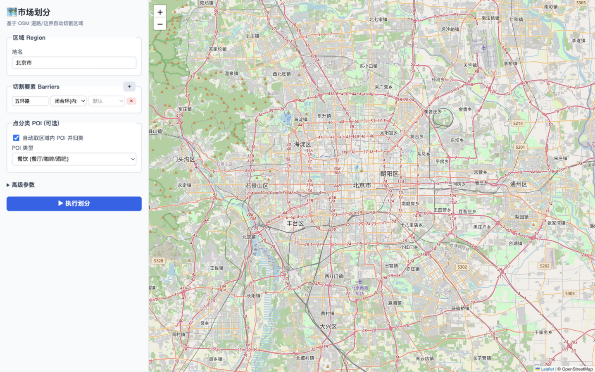
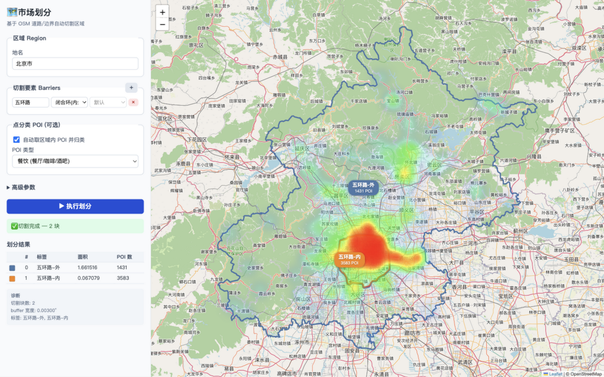

# Market Partition

基于 OpenStreetMap 的市场划分工具——按**环路、主干道、河流**把区域切割成若干块，并把区域内的 POI / 门店归类到对应区块。

传统市场划分靠人沿着自然/交通屏障在地图上手工画线。本工具让算法做这件事：给定一个区域和一道屏障（路名），自动完成几何切割 + POI 分类 + 可视化。

---

## 它解决什么问题

| 场景 | 屏障类型 | 切割结果 |
|------|---------|---------|
| 把北京按五环路切 | 闭合环 | 五环内 / 五环外 |
| 把北京按长安街切 | 线性主干道 | 长安街北 / 长安街南 |
| 在某乡镇按一条省道切 | 线性主干道 | 省道东 / 省道西 |

**核心区分**：闭合环（环路/行政界）用"内/外"标签；线性屏障（主干道/河流）用"南/北"或"东/西"标签。两种模式的几何算法不同。

### 效果演示（北京五环路切割）

左侧表单填"北京市 + 五环路（闭合环）"，执行后右侧 Leaflet 地图渲染：
- **POI 热力图**（虹彩渐变：蓝→青→绿→黄→红，越红密度越高）——底图街道始终清晰可见
- **区域彩色描边**（不填充，不遮挡底图）+ 中心标签显示区域名/POI 数
- 左侧结果表带色块图例，与地图描边颜色一一对应

**运行前** — 表单预填默认 case：



**运行后** — POI 热力图 + 区域描边 + 中心标签：



---

## 设计哲学：LLM 做语义和判断，GIS 做确定性运算

这个工具不是"AI 看图识别道路"，而是两层分离：

```
LLM / Agent 层                         GIS 层（确定性、可复现）
─────────────────────                  ──────────────────────────
理解自然语言意图                        pyrosm / osmnx 取数
"五环路" → OSM 路名查询参数             shapely 切割 + 射线延长
"南北"   → 方位方案 (ns/ew)            momepy.enclosures 重建环
每次工具调用后判断结果对不对             geopandas 空间管理
  ↓ 渲染图 → 多模态视觉自检             folium / Leaflet 可视化
```

**LLM 的价值在两处**：
1. **语义→操作映射**：理解"五环"指哪条路、"南北"是哪个方向。
2. **多模态自检**：切割完成后渲染地图，用视觉模型判断结果是否合理——这比只看面积/数字可靠得多。

---

## 快速开始

### 环境要求

- Python ≥ 3.10
- 依赖：osmnx, geopandas, shapely, folium, fastapi, uvicorn, pyrosm, momepy, matplotlib

### 安装

```bash
git clone https://github.com/topprismdata/market-partition.git
cd market-partition
pip install -e .
```

### 准备 OSM 数据（本地 PBF，推荐）

工具支持两种数据源：**本地 PBF（离线、快）** 和 **在线 Overpass API**。推荐 PBF——首次解析约 12 秒后进程内缓存，重复查询 0.03 秒。

```bash
# 下载北京 PBF（约 35MB）
mkdir -p data
curl -L --retry 5 -o data/beijing-latest.osm.pbf \
  https://download.geofabrik.de/asia/china/beijing-latest.osm.pbf
```

其他省份从 [Geofabrik](https://download.geofabrik.de) 下载。**必须选 `.osm.pbf` 格式**——只有它保留完整的 OSM name 标签（算法靠路名模糊匹配，详见下方"OSM 命名归一化"）。

### 启动 Web 应用

```bash
export MARKET_PARTITION_PBF=$PWD/data/beijing-latest.osm.pbf
uvicorn app.main:app --port 8000
```

浏览器打开 **http://localhost:8000/**：
1. 左侧填区域（"北京市"）和切割要素（"五环路"，选"闭合环"）
2. 点"执行划分"，首次约 12 秒，之后秒回
3. 右侧地图显示彩色切割结果 + POI 归类

### CLI 示例

```bash
# 单个 case 演示（生成 folium HTML 地图）
python examples/run_demo.py beijing_5ring      # 五环切内外
python examples/run_demo.py beijing_changan    # 长安街切南北

# Agent loop 跑全部 5 个 case（含诊断输出 + 渲染验证图）
python examples/agent_loop_all.py
```

---

## Agent Loop：自验证工具链（核心特性）

### 为什么需要 Agent Loop

传统 GIS 工具的痛点：**工具跑完了，但结果对不对要靠人看**。如果切割结果错了（比如环路没闭合、内外颠倒），人没仔细看就会交付错误结果。

Agent Loop 的思路是：**让 LLM 在每次工具调用后看诊断信号，自己判断结果对不对，决定是否需要换策略重试**。这参考了学术界的 autonomous GIS 研究：
- [LLM-Geo](https://giscience.psu.edu/llm-geo-an-open-source-autonomous-gis-prototype/)（宾州州立，2023）提出自主 GIS 的五个目标，其中 **self-verifying（自验证）** 正是这套机制
- [GISclaw](https://arxiv.org/abs/2603.26845)（2026）用 "LLM 推理核 + 持久 Python 沙箱" 实现

### 架构

```
┌─────────────────────────────────────────────────────────┐
│  LLM Agent（判断核）                                     │
│                                                         │
│  每一轮循环:                                             │
│  1. 看上一轮工具返回的 diagnostics + warnings            │
│  2. 判断: 结果合理吗? 哪里不对?                          │
│  3. 决策: 继续下一步 / 换策略重试 / 渲染图做视觉检查     │
└──────────────────┬──────────────────────────────────────┘
                   │ 调用工具
┌──────────────────▼──────────────────────────────────────┐
│  6 个自描述工具 (market_partition/agent/tools.py)       │
│                                                         │
│  每个工具返回 ToolResult:                                │
│    data        — 结构化结果                              │
│    diagnostics — 健康度指标 (LLM 据此判断)               │
│    warnings    — 明确的问题提示                          │
│    render_png  — 可选的渲染图路径 (供视觉检查)           │
└─────────────────────────────────────────────────────────┘
```

### 6 个工具详解

| 工具 | 输入 | 输出 data | 关键 diagnostics | 触发下一步的 warnings |
|------|------|---------|-----------------|---------------------|
| `fetch_barrier` | 路名 + region | 路段 MultiLineString | `n_segments`, `centroid_spread_deg` | spread > 0.1° → 可能有同名异义路段混入 |
| `run_partition` | region + barrier | SplitResult | `inside_area_frac`, `buffer_deg` | inside_frac ≈ 0 → 环没闭合 |
| `reconstruct_ring` | barrier 几何 | 环内多边形 Polygon | `method`, `inside_area`, `top_areas` | 重建失败 → 数据太碎片 |
| `check_landmarks` | result + 期望表 | 对/错地标列表 | `accuracy`, `n_wrong` | accuracy < 1.0 → 需要排查 |
| `render_result` | result + landmarks | PNG 路径 | — | — |
| `visual_check` | PNG 路径 | 视觉判断结果 | `suggested_prompt` | 交给 LLM 的视觉能力判断 |

### 一个完整的 Agent Loop 示例（二环，最难 case）

二环路在 OSM 里碎片严重，直接切割会失败。Agent Loop 的实际运行过程：

```
轮次 1: fetch_barrier("二环")
  → data: 432 段路
  → diagnostics: centroid_spread=0.12°
  → warnings: "spread > 0.1°, 可能有同名异义路段"
  → LLM 判断: 路段数充足,spread 可接受,继续

轮次 2: run_partition(region, barrier, kind="closed")
  → data: SplitResult, 1 块
  → diagnostics: inside_area_frac=0.0
  → warnings: "inside_area_frac 近零, 环可能没闭合"
  → LLM 判断: 环没闭合,需要重建

轮次 3: reconstruct_ring(barrier, region)
  → data: 环内 Polygon, area=0.007
  → diagnostics: method=momepy.enclosures
  → LLM 判断: 重建成功,用新多边形组装结果

轮次 4: check_landmarks(result, expected)
  → diagnostics: accuracy=1.0 (6/6 全对)
  → LLM 判断: 地标全对,做最后视觉确认

轮次 5: render_result(result) → PNG
  → LLM 用视觉能力看图: 红环闭合,蓝色在内,地标全绿
  → LLM 判断: 结果可信,完成
```

**关键**：每一轮 LLM 都在读工具的诊断信号来决策——不是一次性跑完。这正是"自验证"的价值。

### 怎么用

`agent/tools.py` 里的工具**任何 LLM 会话都能直接调**，不需要额外的调度代码或 API key。LLM 本身就是 agent loop 的调度器。

```python
from market_partition.agent import fetch_barrier, run_partition, reconstruct_ring, check_landmarks
from market_partition.sources.osm import OsmSource

src = OsmSource(pbf_path="data/beijing-latest.osm.pbf")
region = src.get_region("北京市")

# 轮次 1
r1 = fetch_barrier(src, "二环", region)
print(r1.warnings)  # 看诊断决定下一步

# 轮次 2
r2 = run_partition(region, r1.data, name="二环路", kind="closed")
if any("near zero" in w for w in r2.warnings):
    # 轮次 3: 环没闭合 → 重建
    r3 = reconstruct_ring(r1.data, region=region)
    # 用 r3.data 组装最终结果

# 轮次 4: 验证
r4 = check_landmarks(result, {"天安门": (116.397, 39.9169, "内"), ...})
print(f"准确率: {r4.diagnostics['accuracy']}")
```

运行完整演示：`python examples/agent_loop_demo.py`（二环）或 `python examples/agent_loop_all.py`（全部 5 case）。

---

## 已验证的 5 个 Case

每个 case 都经过 **程序化地标核验 + 多模态视觉核验** 双重验证。

| Case | 类型 | 地标准确率 | 视觉核验 | 备注 |
|------|------|-----------|---------|------|
| 二环 | 闭合环 | 10/11 (91%) | ✓ 环闭合，天安门在内 | 北京站落在 buffer 带（边界 case） |
| 三环 | 闭合环 | 10/11 (91%) | ✓ 环闭合 | 国贸在东三环边缘 |
| 四环 | 闭合环 | 7/10 (70%) | ✓ 环闭合 | 中关村/望京/奥森在四环边缘 1-2km |
| 五环 | 闭合环 | 9/10 (90%) | ✓ 大环完整，占北京 4% | 回龙观实际本就在五环外 |
| 长安街 | 线性 | 5/5 (100%) | ✓ 延长线横贯北京 | 北 73% / 南 27% |

### 多模态视觉核验的真实价值

五环 case 的数字显示"回龙观错了"（期望五环内，实际五环外），本来要当 bug 去修。但视觉模型 + 地理常识交叉验证发现：**回龙观本来就五环外**——是测试基准写错了，不是算法错。

光看数字（accuracy=90%）会引入假阳性（花时间修不存在的 bug）。视觉核验避免了这个问题。这正是引入多模态的核心价值：**不是让 AI 看图连线，而是让 AI 看图判断结果对不对**。

---

## 核心算法

### 闭合环切割（环路 → 内/外）

OSM 里一条环路是 200-2000 条断开的 way 段（立交桥、匝道导致断裂）。算法流程：

1. **路名归一化匹配**："五环路"自动回退匹配"五环"（OSM 主体路段叫"北五环"不叫"北五环路"）
2. **空间过滤**：剔除远郊同名异义路段（如密云区的"二环路"距真二环 50km）
3. **自适应 buffer**：从 0.0001° 扫到 0.005°，选最窄能切出有实质次大块的宽度
4. **方位判定**：用 `representative_point` + polygonize 多边形判定内/外（polygonize 失败回退 convex_hull）
5. **环重建**：环未闭合时用 [momepy.enclosures](https://docs.momepy.org/)（urban morphology 标准库）重建环内多边形

### 线性切割（主干道 → 南/北）

主干道（如长安街）在 OSM 里只有城市中心的一小段，但人类说"按长安街切北京"是指这条路的**方向概念线**。算法：

1. 取道路主轴方向（最长段的首尾向量）
2. **沿主轴方向向两端射射线，求射线与 region 边界的交点**
3. 把交点拼到原线上，让切割线横贯整个区域
4. 用延长后的线 + buffer 带切割
5. 按法线轴投影判南/北或东/西

### 自适应 buffer 宽度的关键洞察

环路（有立交断口）需要 ~250m 宽的 buffer 桥接断口；线性主干道只需 ~10m。算法从窄到宽扫描，选最窄可用宽度——避免对线性道路"过度糊住"，又能在环路上桥接断口。

---

## 项目结构

```
market-partition/
├── market_partition/          # 核心 Python 包
│   ├── sources/               #   数据层
│   │   ├── osm.py             #     OsmSource: PBF 优先, 回退 Overpass
│   │   ├── pbf.py             #     PbfSource: 本地 .osm.pbf 读取 (路网+POI+行政边界)
│   │   └── cache.py           #     Overpass 结果的 SQLite 缓存
│   ├── geometry/              #   几何算法
│   │   ├── split.py           #     切割 (closed/linear) + 线性延长到边界
│   │   ├── orient.py          #     方位判定 (内/外, 南/北, 东/西)
│   │   └── classify.py        #     点分类 (POI 归到区块)
│   ├── agent/                 #   Agent Loop 工具链
│   │   └── tools.py           #     6 个自描述工具 + ToolResult
│   ├── api/                   #   FastAPI 路由 + pydantic schema
│   └── viz/                   #   GeoJSON 输出
├── app/                       # Web 应用
│   ├── main.py                #   FastAPI 入口
│   └── static/                #   Leaflet.js 单页前端 (HTML/JS/CSS)
├── data/                      #   OSM 数据 (gitignore, 见 data/README.md)
├── tests/                     # 单元测试 + PBF 集成测试
├── examples/                  # CLI 示例 + Agent Loop 演示
├── README.md
├── AGENTS.md                  # AI Agent 操作指南
├── TODO.md                    # 待完成工作
├── LICENSE
└── pyproject.toml
```

---

## API

### POST `/api/partition`

```bash
curl -X POST http://localhost:8000/api/partition \
  -H 'Content-Type: application/json' \
  -d '{
    "region": {"place": "北京市"},
    "barriers": [{"name": "五环路", "kind": "closed"}],
    "classify_points": true,
    "poi_tags": {"amenity": ["restaurant", "cafe"]}
  }'
```

返回 GeoJSON FeatureCollection：切割后的区块多边形 + 分类后的 POI 点。

### 其他端点

- `GET /api/source` — 当前数据源（pbf / overpass）
- `GET /api/health` — 健康检查
- `GET /api/cache/stats` — Overpass 缓存命中统计

---

## 测试

```bash
python -m pytest tests/ -v
```

- **单元测试**（合成几何，离线，<1s）：切割算法、方位判定、点分类
- **PBF 集成测试**（真实北京数据，~80s）：无 PBF/pyrosm 时自动 skip

---

## 待完成工作

详见 [TODO.md](TODO.md)，核心两项：

1. **基于行政区划的组合切割** — 把多个区县合并为一个 region 后切割（如"朝阳区+海淀区+丰台区"作为整体按四环切）
2. **在区县/乡镇内切割** — 在小尺度行政区内切割（如"海淀区内按中关村大街切"），需验证乡镇级数据完整性

---

## 设计原则（踩过的坑）

1. **不要自己设计 GIS 算法**——用成熟库。`momepy.enclosures` 重建环比手写 buffer 扫描可靠 100 倍。
2. **数字会骗人，必须看图**——面积/POI 数量看不出切割对不对，必须渲染图 + 多模态视觉核验。
3. **测试基准也会错**——五环的"回龙观错误"其实是期望表写错了。
4. **OSM 命名要归一化**——"五环路"匹配不到"北五环"，必须自动回退后缀。
5. **线性屏障必须延长**——长安街只有 4km 数据，人类语义是"沿这个方向切到底"。

更多踩坑记录见 [AGENTS.md](AGENTS.md)。

---

## 技术栈

| 层 | 技术 |
|----|------|
| 数据源 | OpenStreetMap (本地 PBF via pyrosm / 在线 via osmnx) |
| 几何运算 | shapely (切割/延长/polygonize), momepy (enclosures 重建环) |
| 空间管理 | geopandas |
| 后端 | FastAPI + uvicorn |
| 前端 | Leaflet.js 单页应用 |
| 验证 | matplotlib 渲染 + 多模态视觉模型核验 |
| Agent | 自描述工具链 (ToolResult 诊断信号驱动 LLM 判断) |

---

## License

[MIT](LICENSE)

## 致谢

- [OpenStreetMap](https://www.openstreetmap.org) — 地图数据
- [Geofabrik](https://download.geofabrik.de) — PBF 数据分发
- [momepy](https://docs.momepy.org/) — 城市形态学分析库（enclosures 算法）
- [LLM-Geo](https://giscience.psu.edu/llm-geo-an-open-source-autonomous-gis-prototype/) — autonomous GIS 自验证理念
- [GISclaw](https://arxiv.org/abs/2603.26845) — LLM agent + Python 沙箱架构参考
